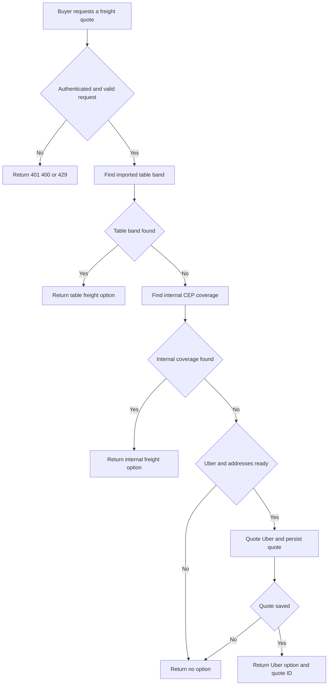
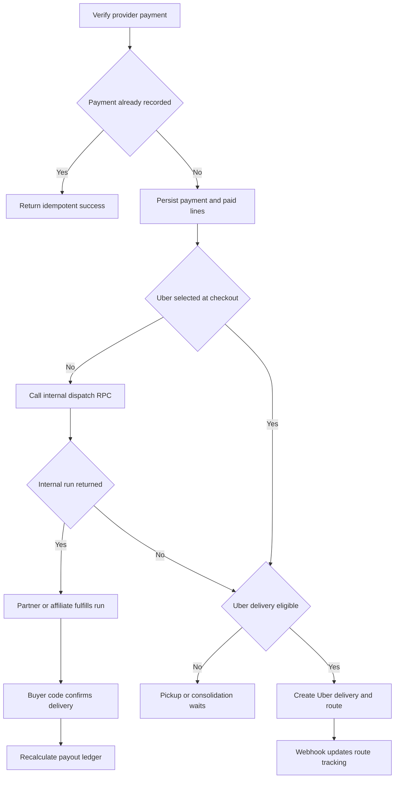

# Fulfillment and Logistics

Fulfillment starts with a server-authoritative freight choice, not a buyer-posted price. After payment is durable, an order may enter the internal `corridas` marketplace, be sent to Uber Direct, wait for a consolidation batch, or be collected at the store. `corridas` owns internal carrier assignment and its proof-oriented lifecycle; `rotas` records manually assigned or provider-backed route tracking.

This is **last-mile dispatch**, not warehouse inventory operation. Checkout reserves stock and later delivery consumes that reservation; choosing a carrier, publishing a run, tracking an Uber delivery, and collecting delivery proof do not themselves decrement warehouse stock. See [Inventory Ledger and Warehouse Operations](inventory-ledger-and-warehouse-operations.md) for inventory semantics, [Checkout, Payment, and Order Lifecycle](checkout-payment-and-order-lifecycle.md) for order/payment creation, and [Collective Commerce and Affiliates](collective-commerce-and-affiliates.md) for affiliate relationships.

## Freight selection and authoritative quote boundary

`POST /api/checkout/cotar-frete` requires an authenticated requester, allows 20 attempts per minute per user, and rejects missing store ID, malformed CEP, or a non-positive item total. Cart weight is optional and defaults to zero for imported-table matching. It returns at most one option; this is deliberate routing precedence, not a price comparison.

1. `cotar_frete_tabela` is consulted first for an active `tabela_importada` carrier and matching destination-CEP/weight band. A store override wins over an otherwise matching global band.
2. If no table band applies, `cotar_frete_interno` looks for active internal CEP coverage for the store or globally, preferring store-local coverage and then the narrowest range. The application calculates and rounds the percentage fee to two decimals.
3. Only if neither internal path covers the request does the endpoint quote Uber Direct. Missing service configuration, incomplete buyer or store address data, unavailable coverage, provider failure, or quote-persistence failure returns an empty list; the latter failures are sent to Sentry.

This flow shows freight routing precedence at checkout.

### Uber quote integrity

Uber Direct is represented by one global active `transportadoras` row. The quote endpoint calls `/delivery_quotes`, then persists store ID, destination CEP, fee in centavos, duration, and provider expiry in `cotacoes_frete_externo`. RLS is enabled without direct policies, so the API service client and `SECURITY DEFINER` checkout logic form the access boundary.

At creation, `checkout_criar_pedido` re-resolves the order store and validates that the chosen carrier is active for it. For `uber_direct`, the RPC requires a saved, unexpired quote belonging to that store and derives freight from `fee_centavos`, never a browser-supplied amount. It rejects missing/expired quotes and unsupported `mercado_envios`; non-Uber delivery is revalidated against carrier/CEP coverage. The chosen freight is allocated across delivery lines.

## Payment-to-delivery routing

`confirmarPagamentoPedido` is the shared Asaas webhook/manual-confirmation core. It validates the stored charge ID and that the received amount is at least the server-owned order total. `dt_pagamento` is the idempotency fact: the initial update is conditional on that field being null, so a duplicate webhook or a race with manual recovery does not re-notify or re-dispatch.

The durable payment write and marking item lines paid happen before notifications and routing. WhatsApp/email, internal dispatch, route geometry, and Uber dispatch are best-effort integrations; their failure is reported but **does not reverse a confirmed payment**. A paid order can consequently require operational recovery when it has no carrier assignment.

This flow separates the irreversible payment fact from best-effort last-mile effects and from later payout eligibility.

### Internal runs, exclusive handoff, and consolidation

Unless a line explicitly selected the fixed Uber Direct carrier, the confirmation core calls `despachar_corrida_automatica`. The RPC is idempotent by `pedido_id`: it returns an existing run when present, returns no run for pickup or consolidated freight, or creates a `primeiro_aceita` order-backed run. A normal run uses the sum of delivery-line freight as suggested/final price, a temporary 1 kg weight, and a four-hour collection window.

When the store has an eligible logistics affiliate, that affiliate receives a five-minute exclusive acceptance window. After it expires, approved platform partners can see the published run. `aceitar_corrida` locks and revalidates the run, its mode, publication state, exclusive window, and actor eligibility before assigning it. A run which requires affiliate review must be revised by the exclusive affiliate—weight, volume, time window, and description—before that affiliate can accept it. Non-order runs may instead use the `leilao` bid mechanism.

Consolidated freight is intentionally deferred rather than a failed dispatch. Checkout discounts each eligible delivery line to 70% of its original freight, adjusts the order total by the cent-accurate difference, and marks the order `frete_consolidado`. An administrator-only `criar_lote_consolidacao` requires at least two paid, consolidated, unassigned orders from one store with a shared three-digit destination CEP corridor. It creates one manifest run priced at the discounted freight sum and attaches orders through `lote_pedidos`; an admin may cancel an uncollected batch to release orders for another batch.

## Delivery execution, proof, and inventory handoff

A logistics-partner profile begins `Pendente`; only an administrator can approve or suspend it. The profile action requires initial acceptance of the current CMS terms version and preserves that acceptance on later edits. Approved partners are the platform pool, while a store-approved logistics affiliate is the exclusive-first recipient described above.

An assigned partner or affiliate advances `corridas` only through `Aceita` → `Coletada` → `EmTransito` → `Entregue`. For an order-backed run, the application first calls `pedido_confirmar_entrega` when entering `Entregue`; the RPC accepts only the store owner or the responsible non-cancelled run carrier, requires `Pagamento Realizado`, and validates the buyer code. A correct code marks every line's `entregas` record `Entregue`, resets failed-code attempts, recalculates the payout ledger, and is idempotent if all lines were already confirmed. Delivery photo proof is required only for a standalone run; buyer-code proof serves that role for an order-backed run. Entering `EmTransito` sends a buyer notification after the status change.

`entregas` is the fulfillment record shared by seller, logistics, and public confirmation paths. When every line is delivered—using `entregas.status` or the legacy line flag—the delivery trigger consumes that order's active/confirmed `estoque_reservas`. This changes reservation state rather than decrementing stock again: available stock was already reduced at checkout. `Enviado` also consumes reservations, and cancellation restores them under the inventory lifecycle rules.

A public third-party-deliverer path accepts sale ID, buyer code, and deliverer name without platform login. It requires a paid order, audits both wrong and successful attempts, caps attempts at five, and returns idempotent success for an already-completed delivery. It updates all line deliveries, resets attempts, and recalculates the same payout ledger. This is a deliberately weaker identity boundary than an assigned logged-in carrier, mitigated by the buyer code, audit record, and per-order cap.

Manual `rotas` are distinct from `corridas`: their assigned affiliate or partner may move only `Atribuida` → `EmTransito` → `Entregue`, and that route-status RPC does not validate a buyer code.

### Delivery and payout eligibility

Delivery confirmation creates or refreshes pending seller and affiliate ledger rows through `repasses_recalcular_pedido`; seller value is derived from line value minus platform and affiliate allocations when no legacy seller value exists. The transfer processor independently checks PIX eligibility and key data, then atomically claims each row from `pendente` to `processando` before calling Asaas. Only the claimant makes the transfer; it records `transferido`, `inelegivel`, or `falhou` afterward. A transfer problem never rolls back delivery.

A seller/admin can request recovery through `repasse_solicitar_pedido`, but it requires the paid lifecycle and **every** line delivered before recalculating the same ledger. It is not an early-payout bypass. The seller action's payment-only UI comment must not be treated as the authorization rule; the RPC is authoritative.

## Uber Direct fallback and webhook tracking

The server-only Uber client is enabled only when `UBER_DIRECT_CUSTOMER_ID`, `UBER_DIRECT_CLIENT_ID`, and `UBER_DIRECT_CLIENT_SECRET` are all present. It obtains an OAuth `client_credentials` token with `eats.deliveries` scope and caches it in-process until five minutes before expiry. It uses unstructured formatted addresses and normalizes Brazilian local phone values to E.164 when creating deliveries.

Post-payment Uber dispatch proceeds only when no internal run exists and the order is eligible. It rejects consolidated freight, pickup/incomplete delivery data, incomplete store pickup data, disabled configuration, or an existing run. It obtains a fresh provider quote, creates a delivery with the order UUID as `external_id`, and inserts a `rotas` row with provider ID, provider status, tracking URL, fee, and internal `Atribuida` status. Thus an explicit Uber checkout selection skips internal dispatch, while Uber remains a fallback when internal dispatch returns no run. Provider failure is best-effort and leaves the paid order intact.

The Uber webhook handler locates `rotas` by `uber_delivery_id`, stores the raw provider status and any tracking URL, and maps `pending`/`pickup` to `Atribuida`, `pickup_complete`/`in_transit` to `EmTransito`, and `delivered` to `Entregue`. The in-transit buyer notice happens after persistence. If `UBER_DIRECT_WEBHOOK_SIGNING_KEY` is configured, the handler verifies `x-uber-signature` against the raw body using HMAC-SHA256 and a timing-safe comparison. If it is absent, validation is bypassed; production must configure the endpoint-specific signing key.

## Operational boundaries and focused verification

- Keep checkout price authority on the server: carrier activity/store ownership, table and CEP coverage, quote ownership/expiry, and fee derivation are separate integrity guards. A new external carrier needs quote persistence plus an authoritative `checkout_criar_pedido` branch, not just a client option.
- Preserve idempotency boundaries: `dt_pagamento is null` for payment effects, `pedido_id` lookup for internal-run dispatch, delivery-code idempotency for fulfillment, and `pendente` → `processando` for transfer execution.
- Configure `UBER_DIRECT_CUSTOMER_ID`, `UBER_DIRECT_CLIENT_ID`, `UBER_DIRECT_CLIENT_SECRET`, and `UBER_DIRECT_WEBHOOK_SIGNING_KEY`. Monitor Sentry signals for checkout quotes, `roteirizacao_pos_pagamento`, Uber, and payout transfer failures; paid-but-unassigned orders are an operational exception, not a payment reversal.
- `calcularTrajeto` is supplementary. Google Routes is called only with `GOOGLE_MAPS_API_KEY` or legacy `GOOGLE_MAPS_API` and below the per-process `GEO_MAX_CHAMADAS_DIA` ceiling (default 5000); explicit failure states avoid invented metrics, while a Google Maps directions link remains available without the integration.
- `src/lib/checkout/opcoes-frete.test.ts` covers percentage rounding, centavos conversion, internal precedence, Uber fallback, and no coverage. `src/lib/uber-direct.test.ts` covers Brazilian E.164 normalization. `src/lib/logistica-parceiro/entregas.test.ts` covers accepted delivery states and interpretation of wrong-code/idempotent confirmation results. Database changes should exercise quote expiry/ownership, concurrent run acceptance, repeated payment dispatch, consolidation eligibility, delivery-code limits, reservation consumption, and payout claim races.
