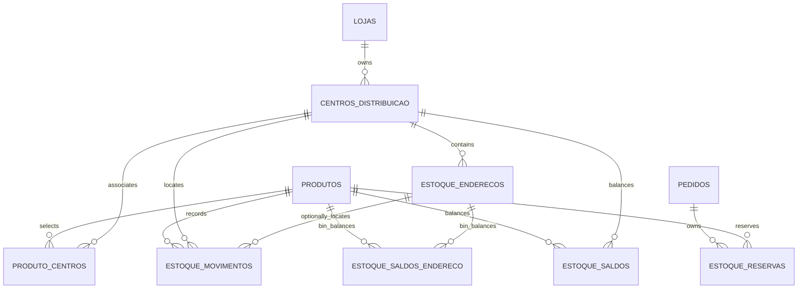
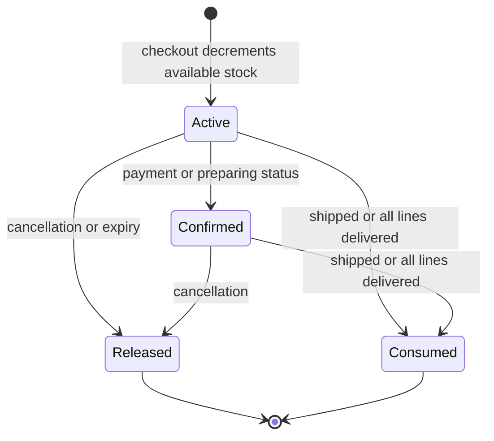

# Inventory Ledger, Reservations, and Warehouse Locations

Inventory has three deliberately different representations. Do not substitute one for another:

- **Available stock** — `produtos.estoque_atual` is the current authority used by checkout and storefront availability. Creating an order decreases it immediately, so it remains the sellable quantity rather than total physical quantity.
- **Audit ledger and center mirror** — immutable `estoque_movimentos` records explain changes, while `estoque_saldos` is the non-negative materialized balance for a `(produto_id, centro_id)` pair. For ordinary inventory, movements are mirrored from changes to available stock; they provide traceability and a center allocation, not a replacement availability API.
- **Physical address balance** — `estoque_saldos_endereco` is the auxiliary per-product/per-bin balance produced only when a movement has `endereco_id`. It aids warehouse custody and may not be interchangeable with center or available balances. In particular, future-sale inventory has no physical position and never enters either balance table.

An order-owned reservation links the immediate availability decrease to payment, cancellation, and delivery. It is not an extra availability decrement. This separation prevents both overselling and the common mistake of decrementing a product again when its delivery is completed.

See [Checkout, Payment, and Order Lifecycle](checkout-payment-and-order-lifecycle.md) for the payment/checkout flow and [Fulfillment and Logistics](fulfillment-and-logistics.md) for dispatch and delivery actors.

## Data ownership and location model

`centros_distribuicao` is the warehouse-level location. Each center has a `tipo` of `seller` or `industria`, and an optional structured integer `cep`; an `industria` center must have a CEP. The database creates an active `Estoque principal` center as the default when a store is created, and a partial unique index permits at most one `padrao` center per store. Deleting a default center promotes the oldest other active center, but the delete is refused if there is no replacement or if its summed center balance is positive. These are triggers and constraints, so direct database paths cannot bypass a seller-page check.

A product may be associated to centers through `produto_centros`. `estoque_centro_do_produto` resolves a single distinct association when exactly one exists; no association **or multiple associations** falls back to the owning store's default center. Thus the multi-selection UI is not inventory allocation or split fulfillment. In addition, the database currently rejects association to an `industria` center until receiving and picking support exists. A safe implementation that introduces multi-center allocation must replace this fallback with an explicit allocation and movement policy, rather than treating existing links as quantities.

This entity flow distinguishes sellable product stock, append-only movements, center mirrors, bin-level mirrors, and order reservations.

### Ledger and saldo mechanics

A movement requires a nonzero quantity, a bounded type/origin, and a nonblank reason. Its `before update or delete` trigger always raises: corrections are represented by a compensating movement, preserving the original audit trail. Insert triggers create the required center/address saldo row at zero and then add the delta. The final update locks the balance row and the non-negative check rejects depletion below zero, serializing competing changes for the same product/location.

Updating `produtos.estoque_atual` causes `estoque_espelhar_produto` to resolve a center and append the corresponding movement. A seller adjustment must instead use `estoque_ajustar_produto`: it authenticates the store owner, locks the product, rejects negative totals and blank reasons, sets a transaction-local reason, and writes the authoritative product balance. The mirror trigger then labels that movement as a seller adjustment. Product creation with initial stock similarly produces an initial movement. If no center can be resolved, the product update is not blocked, but an `auditoria_eventos` exception record reports that the movement was outside the ledger and parity needs investigation.

`vendas_futuras.estoque` is a separate, nonphysical availability source. Its insert/update trigger appends a ledger row with `venda_futura_id`, but the saldo triggers intentionally ignore it. Consequently, parity between ordinary ledger/center saldo and `produtos.estoque_atual` excludes future-sale movements; do not assign a bin or center balance to inventory that has not arrived.

### Warehouse bins and access boundary

`estoque_enderecos` identifies a bin with trimmed street, building, level, and apartment components. Its uppercase generated `codigo` and unique `(centro_id, codigo)` index prevent aliases for one position. A blocked bin requires a reason; it may be emptied but cannot receive a positive movement. Before a movement is inserted, database validation rejects a nonexistent or other-center bin and, for ordinary stock, requires an address for an incoming movement at an `industria` center. Future-sale movements must have no address.

Sellers use security-definer RPCs—`estoque_endereco_criar`, `estoque_endereco_bloquear`, `estoque_endereco_excluir`, and `estoque_enderecos_criar_lote`—rather than direct writes. Each resolves center ownership through `lojas.owner_id`; RLS grants owner-scoped reads but no client write policies. A bin with positive address saldo cannot be deleted. This means the UI actions translate database errors, but the database remains the authority for ownership, reasons, balance preservation, and write paths.

For batch creation, `gerarPosicoes` expands comma-separated literal, numeric, and single-letter ranges into the four-way Cartesian product used by both preview and server action. It uppercases/deduplicates values, rejects literal hyphens that would make generated codes ambiguous, and enforces a 2,000-position limit before materializing a huge range. The RPC repeats empty-input, ownership, hyphen, and limit checks, inserts the batch atomically in a fixed order, and skips already-existing bins. Repeating a partially overlapping batch is therefore intentional and returns only the number newly created.

## Reservation lifecycle

At checkout, the authoritative `checkout_criar_pedido` transaction locks the eligible product, verifies the current available quantity, lowers `produtos.estoque_atual` (or `vendas_futuras.estoque` for a future sale), and inserts an `ativa` `estoque_reservas` row with product/order/source/quantity and a 30-minute expiry. The availability write produces the ordinary ledger mirror; the reservation supplies identity and lifecycle context for the withheld units.

The reservation table accepts only positive quantities and four states: `ativa`, `confirmada`, `consumida`, and `liberada`. An active row must have an expiry; a released or consumed row must have a reason. Database status and delivery triggers, rather than just application callers, apply the lifecycle because payment webhooks, seller workflows, operations, and delivery records may update different tables.

This state machine is for an order-line reservation; available stock changes at creation and release, while confirmation and consumption primarily settle the reservation state.

### Release, expiry, and late payment

`pedido_restaurar_estoque` restores only active or confirmed reservation rows, aggregates duplicate product lines, returns normal stock to `produtos` and future-sale stock to `vendas_futuras`, then marks the rows released in the same transaction. That state predicate makes cancellation/retry paths idempotent. Expiry operates on whole awaiting-payment orders, not individual lines: it calls the restoration function, marks the reason as expiry, releases coupon use, and cancels the order.

Expiry is invoked for the product under consideration *before* checkout decides availability, so a stopped cron cannot make a buyer see expired stock as unavailable. The scheduled route is cleanup: it calls `estoque_reservas_expirar(null)`, identifies candidate orders before the RPC, and sends cancellation mail only to candidates that are actually canceled afterwards. Email is best effort; restoring inventory and canceling the order are already durable. A payment arriving after expiry does not re-decrement stock; the status trigger writes an audit event for operational refund/review instead.

Payment and `Em Separação` turn active rows into confirmed rows and clear expiry. A transition to `Enviado` consumes still-active/confirmed rows. Separately, delivery triggers consume them once every order line is delivered, accepting either `entregas.status = 'Entregue'` or the legacy `linha_itens.entregue` flag. This handles the actual delivery model, where an order can remain `Pagamento Realizado` despite completed delivery. A pre-dispatch guard rejects shipping when all reservations have already been released, preventing shipment of stock returned to the available pool.

## Stock health and operations

`estadoEstoque` classifies current availability as `esgotado` at zero or below, `critico` at or below an explicit positive minimum (otherwise 5), and `normal` above it. An out-of-stock product is outside the storefront only when it lacks a future-sale offer with positive `vendas_futuras.estoque`; such an offer is labelled as selling by reservation rather than a stock-health failure.

`GET /api/estoque/alerta/tick` is a daily Vercel Cron endpoint protected by `Authorization: Bearer $CRON_SECRET`; its manual `POST` counterpart requires `ASAAS_WEBHOOK_TOKEN`. With a configured service role it queries approved products and future-sale availability, groups actionable critical/out-of-store products by store, and emails each store. `alertas_enviados` suppresses a same product/state key for seven days. It writes suppression after a successful email—and also after a known-undeliverable address to stop perpetual processing—but leaves ordinary email failures unsuppressed for a later retry. Failures and partial results are recorded through `registrarEvento`.

`GET /api/estoque/reservas/expirar` uses the same cron secret, while its manual `POST` uses the Asaas token. Both inventory ticks return 503 and emit an operational failure event if `SUPABASE_SERVICE_ROLE_KEY` is absent. `vercel.json` schedules the alert at `0 11 * * *` and reservation cleanup at `30 5 * * *`; checkout-side expiry is the correctness backstop between those daily runs.

## Change and verification guidance

- Preserve the authoritative direction: change availability through guarded database routines and let triggers record the ledger. Never make a dashboard total, a center saldo, or a bin saldo the checkout authority without an explicit migration of every dependent reader and writer.
- Preserve append-only movement semantics. Add new movement origins/types, compensation behavior, or location allocation through constraints/triggers and migration tests, not a client-side convention.
- Treat selected product centers as routing metadata under the current exact-one resolver. Adding allocation, receiving, picking, or transfers needs explicit balanced movements and reconciliation rules; a product with multiple links currently resolves to the default center.
- Exercise database paths for concurrent final-unit purchases, adjustment with a missing reason, deletion of a nonempty center/bin, default-center replacement, blocked-bin receipt, cross-center address injection, and a direct ledger update/delete attempt.
- Run focused range tests with `npm test -- src/lib/estoque/faixa-enderecos.test.ts`. They cover normalization, Cartesian code construction, empty components, the 2,000 cap, immediate rejection of enormous numeric ranges, and hyphen ambiguity. For operations, also test expired order release, repeated cancellation, late payment after release, delivery proof through both current and legacy paths, and alert suppression/retry behavior.

Related: [Data Access, Security, and Schema Evolution](../architecture/data-access-security-and-schema-evolution.md), [Marketplace Catalog and Roles](../concepts/marketplace-catalog-and-roles.md), [Runtime Configuration and Observability](../operations/runtime-configuration-and-observability.md), and [Verification Strategy](../testing/verification-strategy.md).
