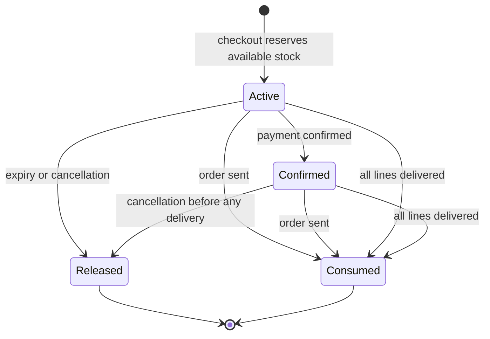
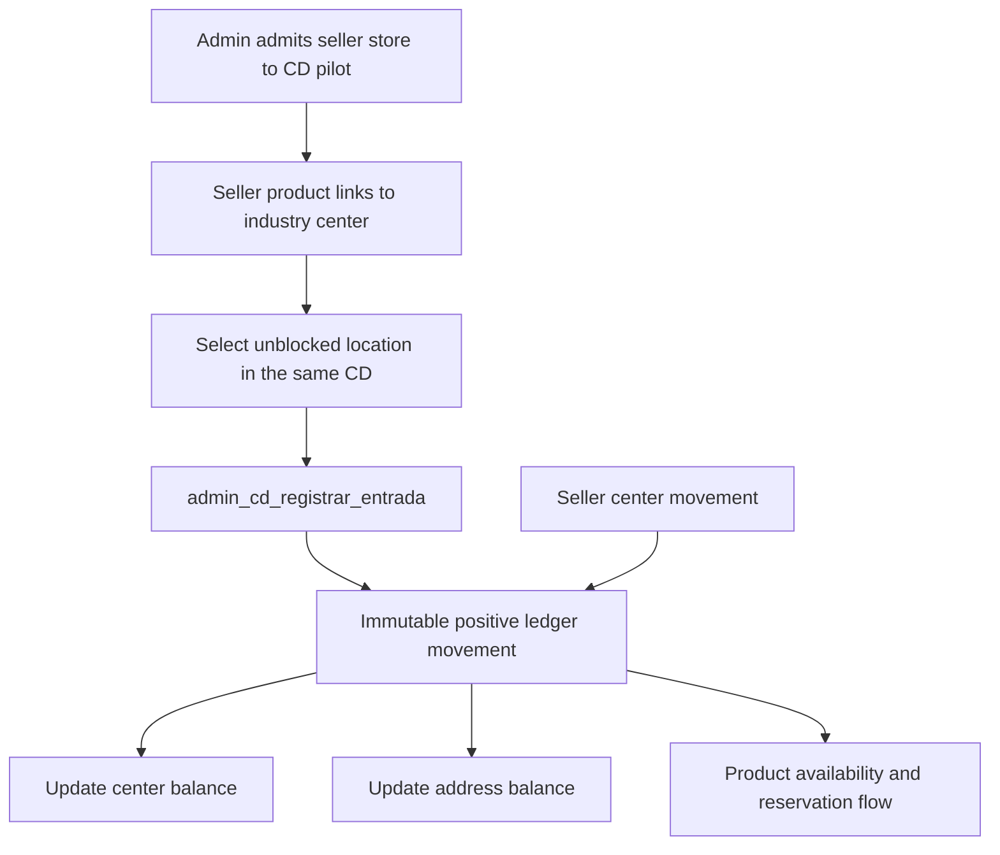

# Inventory Ledger and Warehouse Operations

Inventory has two related responsibilities: it determines what can be sold now, and it records where accountable stock changed. The authoritative history is `estoque_movimentos`, while `estoque_saldos` is its non-negative balance by product and distribution center. Product `estoque_atual` remains the **available-to-sell** figure used by checkout and catalog behavior; an order creation subtracts it as a reservation rather than as a final physical dispatch.

That distinction matters operationally. A paid or delivered order should not accidentally restore already-shipped goods, and an unpaid order must not lock sellable stock forever. The database—not a timer or a browser—owns the reservation lifecycle, balances, audit fields, and warehouse guards.

Related workflows: [Checkout, Payment, and Order Lifecycle](checkout-payment-and-order-lifecycle.md) creates the reservation and progresses orders; [Fulfillment and Logistics](fulfillment-and-logistics.md) covers carrier selection and last-mile dispatch rather than warehouse stock handling. For migration/RLS conventions, see [Data Access, Security, and Schema Evolution](../architecture/data-access-security-and-schema-evolution.md).

## Ownership model and ledger invariants

`estoque_movimentos` records a non-zero signed quantity, movement type (`entrada`, `saida`, `ajuste`, or `transferencia`), origin, non-empty reason, optional author, product, center, optional order, and timestamp. Rows are immutable at the database boundary: update and delete both fail, so corrections require a compensating movement rather than rewriting history. An insert trigger creates the center balance row if needed and serializes the balance update on that `(produto_id, centro_id)` row; the `quantidade >= 0` constraint prevents concurrent final-unit sales from producing a negative balance.

`estoque_saldos` is therefore a materialized operational balance, not a writable alternative ledger. Direct client writes to movement and balance tables are denied by RLS; sellers can read records for their products but do not receive write policies. The supported seller adjustment is `estoque_ajustar_produto(produto_id, quantidade, motivo)`: it authenticates the owner, requires a non-empty reason, locks the product, and carries that reason through the product-stock trigger into the immutable ledger. Product edit actions deliberately omit `estoque_atual` from the ordinary update and call that RPC only when the supplied total differs.

Checkout and system reversals also mutate `produtos.estoque_atual`, but the trigger mirrors the delta into the ledger with an appropriate source and reason. This compatibility path is why callers must not casually overwrite product stock: bypassing the sanctioned adjustment loses the explicit operational reason and can misclassify a change even though a trigger records a delta. The safe extension boundary is an audited RPC or a purpose-built ledger insertion that preserves center, location, authorization, and reason invariants.

Each store has exactly one default distribution center. A product linked to exactly one center resolves there; otherwise it falls back to its store default. A database trigger creates a default center for new stores. A center cannot be deleted while it contains stock, and deleting the default requires another active center, which is promoted after deletion. If no center can be resolved for a product-stock update, the system writes an `estoque.sem_centro_resolvivel` audit event rather than silently pretending the ledger still reconciles.

## Available stock, reservation, and delivery consumption

At checkout, `checkout_criar_pedido` locks each product, verifies approval, seller activity, quantity and available stock, subtracts the requested normal-stock quantity from `produtos.estoque_atual`, and inserts an `estoque_reservas` record. An active reservation has a 30-minute expiry and belongs to the order, product, quantity, and, where applicable, the future-sale offer that supplied it. The product decrement is mirrored as a ledger `saida`, but it represents removal from the sellable pool—not a second decrement at pick or ship time.

The reservation state is one of `ativa`, `confirmada`, `consumida`, or `liberada`:

- **Active** reservations expire while the order awaits payment.
- Payment confirmation changes active reservations to **confirmed** and removes their expiry.
- A cancellation restores only active/confirmed quantities, then makes them **released** in the same transaction, making repeated cancellation paths idempotent.
- Dispatch (`Enviado`) consumes open reservations. More importantly for this application, delivery triggers consume them once **all** order lines are delivered, whether via `entregas.status = 'Entregue'` or the legacy `linha_itens.entregue` flag.
- A cancellation cannot restore stock or proceed through the normal seller/admin cancellation flow after any item is delivered. For a partial-delivery edge case, restoration is skipped and audited rather than adding goods already with a buyer back to sellable stock.

This state diagram shows the reservation record; only checkout/reservation release changes sellable quantity, while consumption closes the accountability lifecycle.

### Expiry is an availability guarantee at checkout, not a cron promise

`estoque_reservas_expirar(produto_id)` finds expired active reservations on orders still awaiting payment, releases all open reservations for each affected order, releases its coupon use, and cancels the order. It operates per order so it never returns one line while retaining a partially valid order. The release update is idempotent because only active or confirmed rows qualify.

The checkout RPC calls this expiration function for the requested product **before** testing available stock. This is the availability guarantee: a buyer trying to buy cannot be rejected merely because another buyer's expired hold remains. The scheduled `GET /api/estoque/reservas/expirar` sweep is cleanup for conservative catalog balance and abandoned-order cancellation, not the mechanism that makes the 30-minute promise correct. It uses service-role access, requires `Authorization: Bearer $CRON_SECRET` (manual `POST` uses `ASAAS_WEBHOOK_TOKEN`), and records observability events. It captures candidate order IDs before the RPC and emails only those that are actually cancelled afterward, avoiding a false cancellation email if payment wins the race.

A late payment after an expired and released reservation is deliberately not re-reserved or re-decremented; the payment transition writes an audit event (`pedido.pago_sem_reserva`) for operational resolution. Likewise, `Em Separação` confirms an active reservation only when the order was already paid; moving an unpaid order there must not hide it from expiry.

## Future-sale availability is a separate inventory axis

A `vendas_futuras` offer has its own `estoque`. Checkout decrements that offer rather than `produtos.estoque_atual`, and a reservation records `venda_futura_id` so cancellation returns quantity to the correct pool. Future-sale inventory is represented in `estoque_movimentos` with `venda_futura_id`, including opening, checkout, and restoration entries, but it intentionally does **not** update a center or address balance: promised future goods have no physical warehouse position yet.

The public `produtos_vendaveis` view is the single sellability rule for catalog listing: a product must be approved, in an active store, priced, and have either positive immediate stock or a future-sale offer with positive stock. An out-of-stock product with a live future offer therefore remains sellable by reservation; seller/admin and checkout reads continue to use base tables because they need visibility into ruptures and validation details.

## Warehouse boundaries: centers, locations, and the CD pilot

A distribution center is a stock location with type `seller` or `industria`. `industria` centers require a structured numeric CEP. A storage location (`estoque_enderecos`) is a center-local combination of street, building, level, and apartment; its uppercase `codigo` is generated by the database, unique within the center, and cannot diverge from those component fields. A blocked location requires a reason. Sellers may read their own locations; authenticated users can also view industry-center locations, while position balances remain visible only to the owner of the product stored there.

A movement can optionally name `endereco_id`. The database rejects a location belonging to another center and rejects incoming stock to a blocked location, while allowing an outgoing movement to empty a blocked location. At an `industria` center, inbound physical goods require an address. Address-level balances use the same non-negative, trigger-updated pattern as center balances. A location with stock cannot be deleted.

This flow shows the warehouse movement boundary: a controlled receipt creates the physical CD balance, whereas checkout controls sellable availability through reservations.

The marketplace's `CD Indústria Manaus` is an industry center owned through an inactive marketplace store so the existing ownership/RLS model remains intact. Industry-center use is deliberately gated by `cd_lojas_piloto`: an admin admits a store for a specific CD, then the product-center trigger permits that store's product to link to it. A pilot entry cannot be removed while that store has positive balance in the CD.

For the current pilot, `admin_cd_registrar_entrada` is the authoritative inbound operation. It requires an authenticated admin, positive quantity, a reason, an industry center, an unblocked address belonging to that center, and a product whose store is admitted to that center. It then writes one positive `sistema` ledger movement with the admin as author; the ledger triggers update both balances. The admin fulfillment action calls this RPC rather than inserting stock directly. There is no corresponding warehouse picking/transfer/shipping RPC in the inspected implementation: last-mile shipping and delivery statuses consume reservation accountability, while formal physical picking from a CD location remains an extension point. Do not claim address-level stock has been decremented by picking until such an operation supplies a negative, location-specific ledger movement.

Sellers create, block, and delete their own locations through security-definer RPCs. Batch creation uses `estoque_enderecos_criar_lote` in one transaction: it expands the Cartesian product of the four address dimensions, rejects empty dimensions, hyphens inside components, and more than 2,000 locations, orders inserts deterministically to reduce deadlocks, and skips already-existing codes. The UI uses the same pure expansion helper for preview, preventing a confirmed count from differing from the submitted positions.

## Rupture visibility and operational alerts

The seller-facing stock classifier defines `esgotado` at zero or below, `critico` at the product's positive `quantidade_minima` or the default threshold of 5, and `normal` otherwise. An exhausted product is outside the catalog only when it lacks positive future-sale stock; exhausted-but-reservable inventory is labeled as still selling by reservation.

`GET /api/estoque/alerta/tick` is a daily Vercel Cron endpoint protected by `CRON_SECRET`; a manually invoked `POST` uses `ASAAS_WEBHOOK_TOKEN`. With service-role configuration, it scans approved products, consults future-sale availability, groups critical/out-of-catalog products by store, and emails one grouped alert per store. `alertas_enviados` supplies idempotency using keys such as `estoque:<product-id>:fora` and `estoque:<product-id>:critico`: identical state is suppressed for seven days. Email send failure does not record normal suppression, allowing a later retry; an explicitly undeliverable address is recorded to stop perpetual reprocessing. The endpoint emits success, alert, or failure observability events and returns 503 if service-role configuration is absent.

The Vercel schedules run the stock alert at `0 11 * * *`, future-sale notices at `0 13 * * *`, and reservation cleanup at `30 5 * * *`. Future-sale notice date logic uses the Manaus time zone so notices for a date-only forecast do not shift at UTC midnight; it identifies a two-day-before and day-of milestone.

## Focused verification and change checklist

The focused unit tests protect the most failure-prone pure and race-aware edges:

- `faixa-enderecos.test.ts` checks numeric/letter range expansion, normalization, Cartesian codes, duplicate prevention, empty inputs, hyphen ambiguity, and early rejection of enormous ranges.
- `estoque-estado.test.ts` verifies minimum/default critical thresholds and the difference between out-of-catalog stockout and stockout covered by future sale.
- `avisar-compradores.test.ts` verifies that reservation cleanup emails only orders confirmed cancelled after the expiry RPC, not candidates that paid during the race.

When changing inventory behavior, preserve these database-owned properties: immutable movements; non-negative serialized balances; explicit reasons for human adjustments; default-center resolution; no direct client ledger writes; address/center coherence; pilot admission before industry-CD custody; release/consume idempotency; checkout-time expiry before availability checks; and no restoration after any delivered item. Test database changes with concurrent final-unit checkout, duplicate cancel/expiry/payment signals, payment after expiry, partial delivery then cancellation, blocked/wrong-center addresses, removal of a pilot store with stock, and receipt authorization failures. Treat the expiry cron, notifications, and alert email as recoverable operations around—not replacements for—the transactional ledger and checkout invariants.
